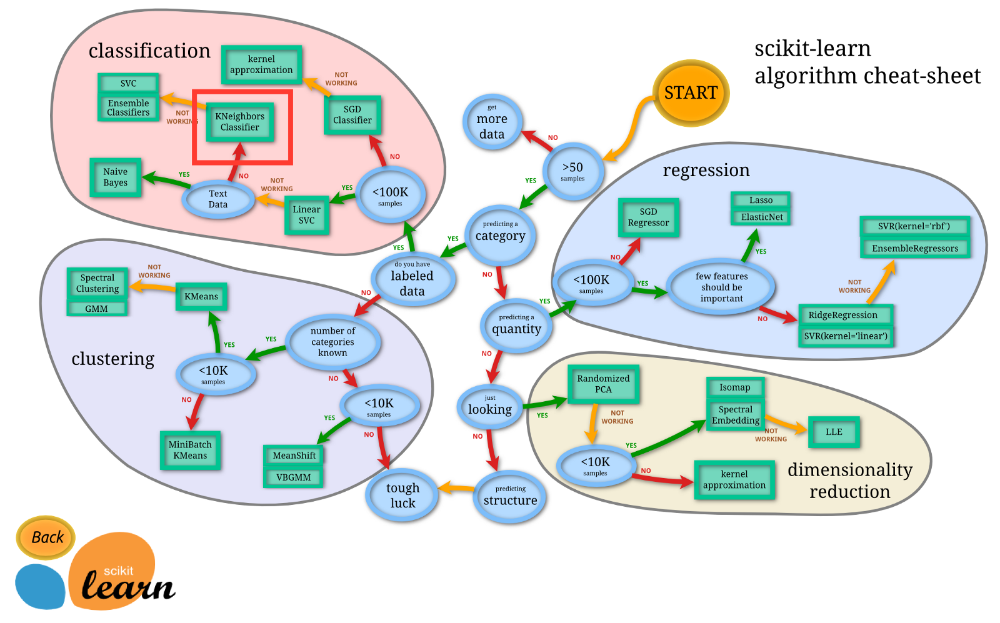

* content
{:toc}




## 特征提取
<https://scikit-learn.org/stable/modules/feature_extraction.html#loading-features-from-dicts>
### 从dict中提取特征


`from sklearn.feature_extraction import DictVectorizer`

```
>>> measurements = [
...     {'city': 'Dubai', 'temperature': 33.},
...     {'city': 'London', 'temperature': 12.},
...     {'city': 'San Francisco', 'temperature': 18.},
... ]

>>> from sklearn.feature_extraction import DictVectorizer
>>> vec = DictVectorizer()

>>> vec.fit_transform(measurements).toarray()
array([[ 1.,  0.,  0., 33.],
       [ 0.,  1.,  0., 12.],
       [ 0.,  0.,  1., 18.]])

>>> vec.get_feature_names()
['city=Dubai', 'city=London', 'city=San Francisco', 'temperature']
```


## 数据预处理
`from sklearn import preprocessing`

### 特征编码

参考:<http://scikit-learn.org/stable/modules/preprocessing.html#encoding-categorical-features>

下述的特征会自动从数据集中提取,并且可以用`catogories_`查看
```
>>> enc.categories_
[array(['female', 'male'], dtype=object), array(['from Europe', 'from US'], dtype=object), array(['uses Firefox', 'uses Safari'], dtype=object)]
```

#### 字符串编码成整数

例如`["from Europe", "from US", "from Asia"]`被编码成`[1,2,3]`
使用方法如下
```
>>> enc = preprocessing.OrdinalEncoder()
>>> X = [['male', 'from US', 'uses Safari'], ['female', 'from Europe', 'uses Firefox']]
>>> enc.fit(X)
OrdinalEncoder()
>>> enc.transform([['female', 'from US', 'uses Safari']])
array([[0., 1., 1.]])
```

#### One-Hot编码
```
>>> enc = preprocessing.OneHotEncoder()
>>> X = [['male', 'from US', 'uses Safari'], ['female', 'from Europe', 'uses Firefox']]
>>> enc.fit(X)
OneHotEncoder()
>>> enc.transform([['female', 'from US', 'uses Safari'],
...                ['male', 'from Europe', 'uses Safari']]).toarray()
array([[1., 0., 0., 1., 0., 1.],
       [0., 1., 1., 0., 0., 1.]])
```
#### 指定编码目录

提前指定要编码的内容,而不是根据数据集自动生成
```
>>> genders = ['female', 'male']
>>> locations = ['from Africa', 'from Asia', 'from Europe', 'from US']
>>> browsers = ['uses Chrome', 'uses Firefox', 'uses IE', 'uses Safari']
>>> enc = preprocessing.OneHotEncoder(categories=[genders, locations, browsers])
>>> # Note that for there are missing categorical values for the 2nd and 3rd
>>> # feature
>>> X = [['male', 'from US', 'uses Safari'], ['female', 'from Europe', 'uses Firefox']]
>>> enc.fit(X)
OneHotEncoder(categories=[['female', 'male'],
                          ['from Africa', 'from Asia', 'from Europe',
                           'from US'],
                          ['uses Chrome', 'uses Firefox', 'uses IE',
                           'uses Safari']])
>>> enc.transform([['female', 'from Asia', 'uses Chrome']]).toarray()
array([[1., 0., 0., 1., 0., 0., 1., 0., 0., 0.]])
```

在one-hot编码下,如果数据集中出现了未指定的数据,那么可以使用`handle_unknown='ignore'`来忽略报错,在这个情况下,该数据会被设置为全0
```
>>> enc = preprocessing.OneHotEncoder(handle_unknown='ignore')
>>> X = [['male', 'from US', 'uses Safari'], ['female', 'from Europe', 'uses Firefox']]
>>> enc.fit(X)
OneHotEncoder(handle_unknown='ignore')
>>> enc.transform([['female', 'from Asia', 'uses Chrome']]).toarray()
array([[1., 0., 0., 0., 0., 0.]])
```


### 数据集划分
```
from sklearn.model_selection import train_test_split

X_train,X_test, y_train, y_test = train_test_split(X,y,test_size=0.4, random_state=0,stratify=y_train)
```
各个参数：
- test_size 测试样本占比，填整数的话即为测试集的数量
- random_state 随机数种子，不填或0的话每次都随机
- stratify 如果不设置，则标签比例随机，按比例分配数据，=X是按照X的比例分配，=y即按照y的比例分配

## 结果评价

### 评估指标

- TP-将正类预测为正类（true positive）

- FN-将正类预测为负类（false negative）

- FP-将负类预测为正类（false positive）

- TN-将负类预测为负类（true negative） 


由此引出:
- precision = TP / (TP + FP)
- recall = TP / (TP + FN)
- accuracy = (TP + TN) / (TP + FP + TN + FN)
- error rate =  (FN + FP) / (TP + FP + TN + FN)
- f1-score = 2\*P\*R/(P+R)，其中P和R分别为 precision 和 recall

```
TP = np.sum(np.logical_and(np.equal(y_true,1),np.equal(y_pred,1)))
FP = np.sum(np.logical_and(np.equal(y_true,0),np.equal(y_pred,1)))
FN = np.sum(np.logical_and(np.equal(y_true,1),np.equal(y_pred,0)))
TN = np.sum(np.logical_and(np.equal(y_true,0),np.equal(y_pred,0)))
print(TP,FP,FN,TN)
P = TP/(TP+FP) 
R = TP/(TP+FN) 
print("accuracy:",(TP+TN)/(TP+FP+TN+FN))
print("recall: ",R)
print("F1:",2*P*R/(P+R))
```
### 调用库

```
from sklearn.metrics import precision_score, recall_score, f1_score
p = precision_score(y_true, y_pred) 
r = recall_score(y_true, y_pred, average='micro')  
f1 = f1_score(y_true, y_pred, average='micro')
```

#### average  

参数 | 解释 
--|-- 
None|返回每一类对应的f1_score
binary|返回由pos_lable指定的类的f1_score,仅二分类问题
micro|此时Precision = Recall = F1_score = Accuracy
macro|对每一类的f1_score进行算数平均
weighted|对每一类别的f1_score进行加权平均，权重为各类别数在y_true中所占比例


### 画混淆矩阵

```
def plot_confusion_matrix(cm, labels, title):
    cm = cm.astype('float') / cm.sum(axis=1)[:, np.newaxis]    # 归一化
    plt.imshow(cm, interpolation='nearest')    # 在特定的窗口上显示图像
    plt.title(title)    # 图像标题
    plt.colorbar()
    num_local = np.array(range(len(labels_name)))    
    plt.xticks(num_local, labels, rotation=90)    # 将标签印在x轴坐标上
    plt.yticks(num_local, labels)    # 将标签印在y轴坐标上
    plt.ylabel('True label')    
    plt.xlabel('Predicted label')
    cm = confusion_matrix(y_test, y_pre,)
    print(cm)
    plot_confusion_matrix(cm, [1,0], "Confusion Matrix")
    plt.show()
```
